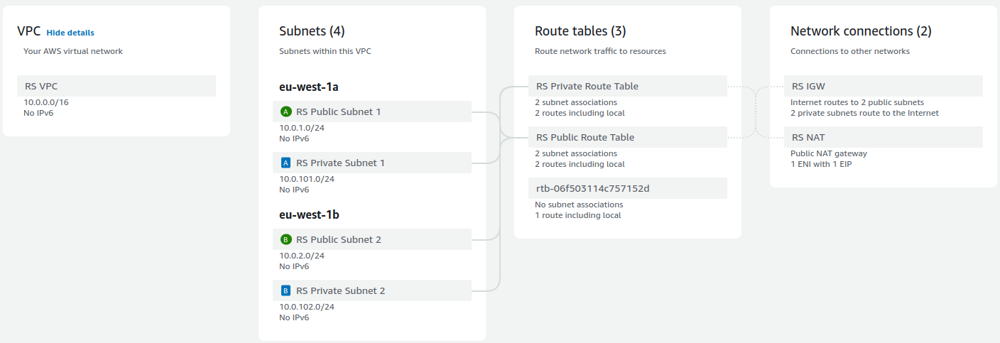
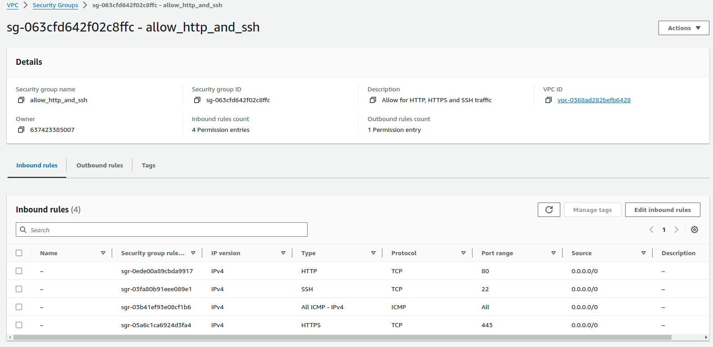
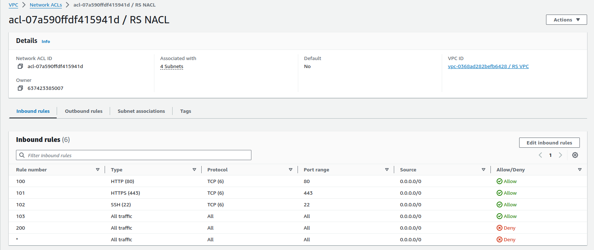
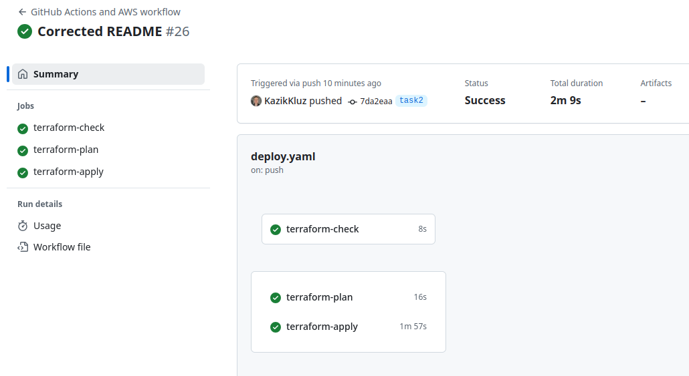

# Task 2: Basic Infrastructure Configuration

---

### New resources added to infrastructure during this phase:

- **VPC**: Service that allows you to launch AWS resources in a logically isolated virtual network.
- **Public Subnets**: These enables communication between resources in the subnet and the internet, as well as with other AWS services
- **Private Subnets**: These are isolating resources from the public internet and can only be accessed from within the VPC. They can reach Public Internet via NAT Gateway or NAT Instace
- **Route Tables and Routes**: Set of rules that determine where network traffic is directed within a Virtual Private Cloud (VPC).
- **Security Groups**: Stateful rules used to control network traffic at the instance level.
- **Network ACLs**: Stateless rules used to controll network traffic at the subnet level.
- **Internet Gateway (IGW)**: A horizontally scaled, redundant, and highly available component that enables instances with public IP addresses to access the internet.
- **NAT Gateway**: A managed Network Address Translation (NAT) service that enables instances in private subnets within a Virtual Private Cloud (VPC) to connect to services outside the VPC, such as the internet or other AWS services, while maintaining security and isolation.

### New files added for Task 2:

#### **vpc.tf**

Defines the VPC, subnets, and main networking components. Create public and private subnets within the VPC in separate availability zones. Creates the NAT instance with appropriate security groups and routing to allow internet access from private instances as well as Internet Gateway for the Internet connection



#### **bastion_host.tf**

Creates the Bastion host in a public subnet to provide SSH access to private instances.

#### **security_groups.tf**

Configures the security groups to manage traffic between the NAT instance, private instances, and the internet and to control traffic between the private instance and the Bastion host.



#### **routing.tf**

Creates a route table for private subnets, routing traffic through the **NAT instance** for internet access. Configures route tables for the public subnets, routing traffic through the **Internet Gateway (IGW)**.

#### **network_acls.tf**

Defines the private and public NACL rules to control access to and from the subnets. Associates network ACLs (NACLs) with private and public subnets to manage inbound and outbound traffic.


---

## How to Run

1. **Initialize Terraform**  
   Run the following command to initialize the project:

   ```bash
   terraform init
   ```

2. **Plan and Apply Configuration**  
    Use the following commands to plan and apply the infrastructure:

   ```bash
   terraform plan
   terraform apply
   ```

```
NOTE! If you are planning to provision the infrastructure to test, then you need to add your
own key-pair name for Bastion Host instead of the default one.
```



3. **Verify Setup**
   - Ensure the Bastion host is accessible via SSH.
   - Verify that private instances can reach the internet through the NAT instance.
   - Check that route tables, security groups, and NACLs are correctly associated.

---

## Cleanup

To destroy all resources, run the following command:

```bash
terraform destroy
```
