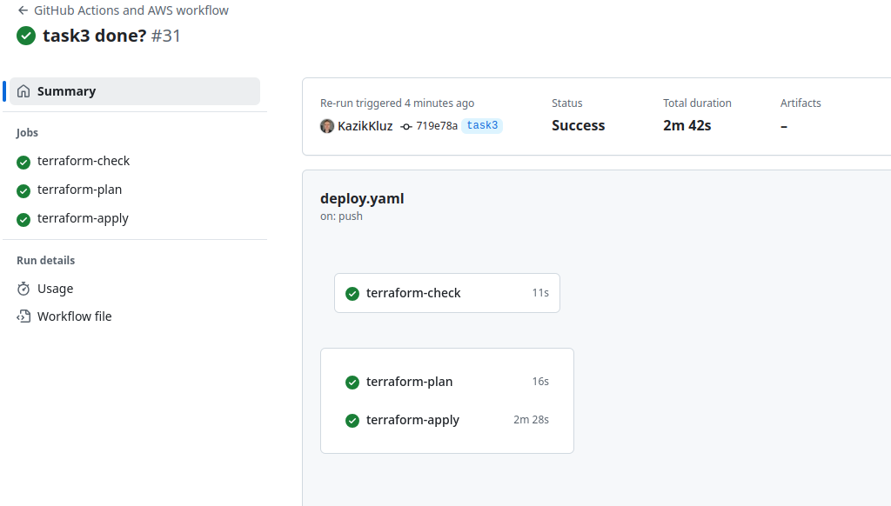
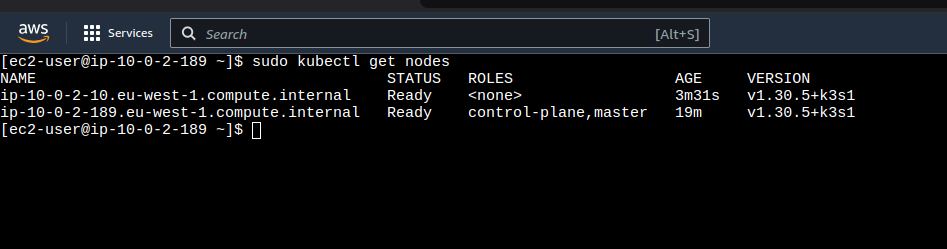
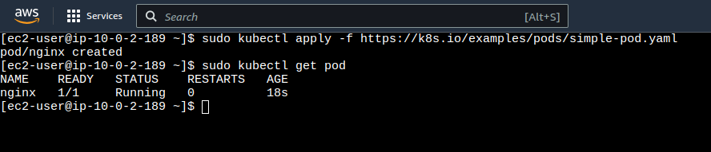
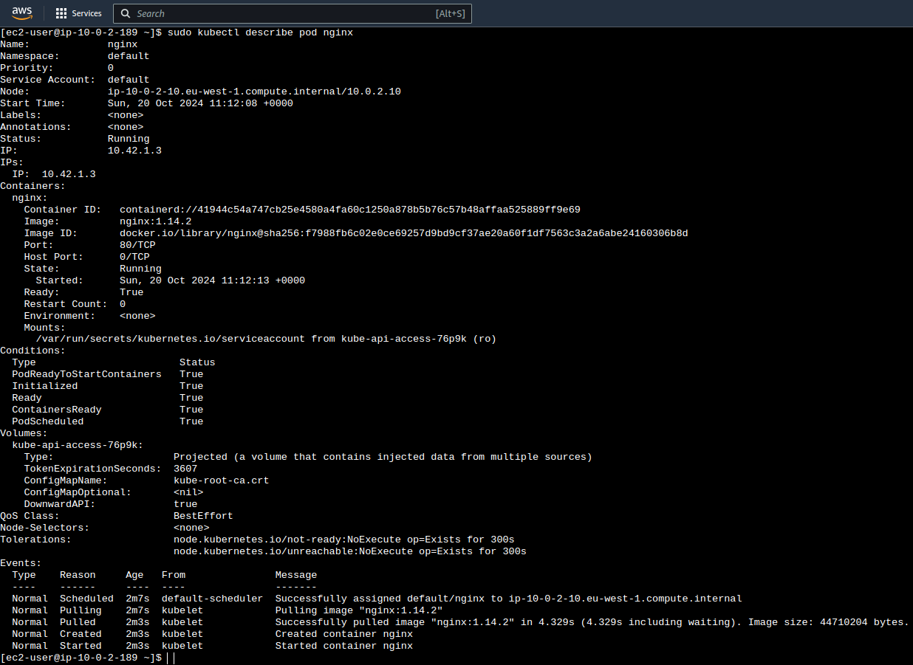

# Task 3: K8s Cluster Configuration and Creation

---

### New resources added to infrastructure during this phase:

- **Master node and Worker Node**: Two EC2 machines running in private subnets and running K8s cluster
- **Security Groups new rules**: To allow communication between master and worker node as well as K8s metric server ports 6443 and 10250 should be accessible
- **Network ACLs new rules**: To allow communication between master and worker node as well as K9s metric server ports 6443 and 10250 should be accesible

### New files and / or changes added for Task 3:

#### **security_groups.tf**

New rules addedd for proper K8s functioning.

#### **network_acls.tf**

New rules added for proper K8s functioning.

#### **k3s.tf**

This file adds two EC2 machines running in private subnets for K8s cluster.

## How to Run

1. **Initialize Terraform**  
   Run the following command to initialize the project:

   ```bash
   terraform init
   ```

2. **Plan and Apply Configuration**  
    Use the following commands to plan and apply the infrastructure:

   ```bash
   terraform plan
   terraform apply
   ```

```
NOTE! If you are planning to provision the infrastructure to test, then you need to add your
own key-pair name for Bastion Host instead of the default one.
```



3. **Verify Setup**

   - Ensure the Bastion host is accessible via SSH.
   - Verify that private instances can reach the internet through the NAT instance.
   - Check that route tables, security groups, and NACLs are correctly associated.

4. **Deploy K3s cluster**

- From Bastion connect to master node and install K3s with `curl -sfL https://get.k3s.io | sh -`
- Confirm that cluster is running: `sudo kubectl get nodes`
- Get generated token running: `sudo cat /var/lib/rancher/k3s/server/token`
- From Bastion connect to the worker node and save token in a variable: `export TOKEN=token`
- Export master node IP address `export SERVER=master_node_ip`
- Install K3s on worker node running: `curl -sfL https://get.k3s.io | K3S_URL="https://${SERVER}:6443" K3S_TOKEN=${TOKEN} sh -s -`
- Wait a bit until agent is initialized and ready.
- Back on master node run `sudo kubectl get nodes`. You should see two nodes and a cluster



- Deploy Nginx to the cluster running `sudo kubectl apply -f https://k8s.io/examples/pods/simple-pod.yaml`



- Inspect the NGINX pod with `sudo kubectl describe pod nginx`.



## Cleanup

To destroy all resources, run the following command:

```bash
terraform destroy
```
