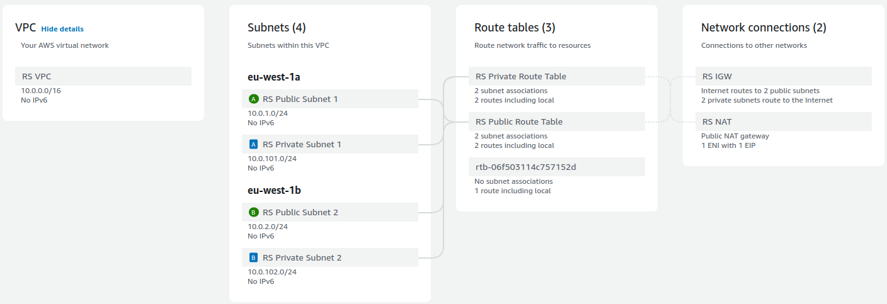

# Task 2: Basic Infrastructure Configuration

---

### New Files added for Task 2

#### **vpc.tf**

Defines the VPC, subnets, and main networking components. Create public and private subnets within the VPC in separate availability zones. Creates the NAT instance with appropriate security groups and routing to allow internet access from private instances as well as Internet Gateway for the Internet connection



#### **bastion_host.tf**

Creates the Bastion host in a public subnet to provide SSH access to private instances.

#### **security_groups.tf**

Configure the security groups to manage traffic between the NAT instance, private instances, and the internet and to control traffic between the private instance and the Bastion host.

#### **routing.tf**

Creates a route table for private subnets, routing traffic through the **NAT instance** for internet access. Configures route tables for the public subnets, routing traffic through the **Internet Gateway (IGW)**.

#### **network_acls.tf**

Define the private and public NACL rules to control access to and from the subnets. Associates network ACLs (NACLs) with private and public subnets to manage inbound and outbound traffic.

---

## How to Run

1. **Initialize Terraform**  
   Run the following command to initialize the project:

   ```bash
   terraform init
   ```

2. **Plan and Apply Configuration**  
   Use the following commands to plan and apply the infrastructure:

   ```bash
   terraform plan
   terraform apply
   ```

3. **Verify Setup**
   - Ensure the Bastion host is accessible via SSH.
   - Verify that private instances can reach the internet through the NAT instance.
   - Check that route tables, security groups, and NACLs are correctly associated.

---

## Cleanup

To destroy all resources, run the following command:

```bash
terraform destroy
```
